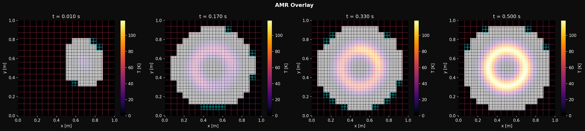
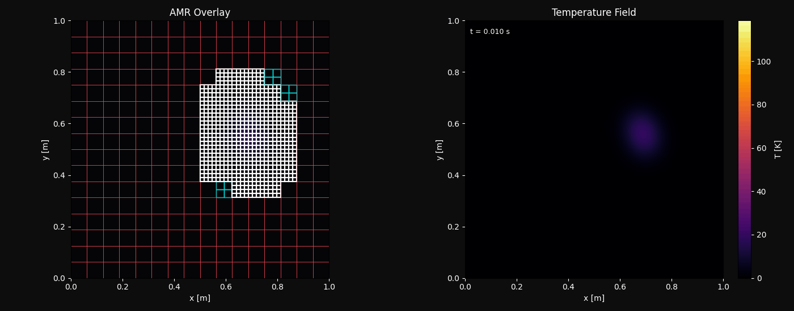

# JAX-AMR

**Author:** Ashwin Shirke





JAX-AMR solves the 2D transient heat equation on a unit-square domain subject to a Gaussian laser source that moves on a circular orbit. Three solver architectures are implemented and benchmarked: a uniform 1024×1024 reference, a dynamic AMR solver that relocates a fine patch each step by tracking the gradient centroid of the coarse field, and a fixed-patch composite solver that pre-places the fine grid over the laser orbit. All three use Crank-Nicolson time integration with 5-point finite difference spatial discretization, implemented entirely in JAX. The composite solvers are fully differentiable end-to-end — `jax.grad` can be called through the entire time loop.

---

## Models

| Model | Concept | DOF | Wallclock | Peak T | Error |
| :--- | :--- | ---: | ---: | ---: | ---: |
| Uniform | 1024×1024 full grid | 1,048,576 | 147.02 s | 118.7011 K | — |
| AMR Dynamic | 128×128 coarse + 512×512 moving patch | 278,528 | 12.80 s | 117.3004 K | 1.18% |
| AMR Fixed | 128×128 coarse + 512×512 at [0.25,0.75]² | 278,528 | 25.03 s | 118.7028 K | 0.0014% |

Measured on Apple M2 CPU, 5000 steps, dt=1e-4 s. AMR Dynamic is 11.5× faster than uniform; AMR Fixed is 5.9× faster. Both AMR variants use 3.76× fewer degrees of freedom.

The dynamic variant tracks the laser with no prior knowledge of its path. The fixed variant requires knowing the orbit in advance but achieves near-identical accuracy to the uniform reference because the fine patch carries uninterrupted thermal history from the first step.

---

## Setup

```bash
python3 -m venv .venv && source .venv/bin/activate
pip install -r requirements.txt
```

Requirements: `jax>=0.4.20`, `jaxlib>=0.4.20`, `numpy>=1.26`, `matplotlib>=3.8`, `imageio>=2.33`, `Pillow>=10.0`, `scipy>=1.11`. No CUDA required.

---

## Running

```bash
# Uniform reference (147 s)
PYTHONPATH=. python runs/run_uniform.py

# AMR Dynamic (12.8 s, 11.5x speedup)
PYTHONPATH=. python runs/run_amr.py

# AMR Fixed (25.0 s, 5.9x speedup)
PYTHONPATH=. python runs/run_composite_amr.py
```

Output goes to `output/uniform/`, `output/amr/`, and `output/amr_fixed/`. Each directory contains `snapshots.png`, `animation.gif`, VTK files, and `.npz` checkpoints.

### Grid overlay animations

Pass `--plot-grid` to generate animations showing the mesh structure:

```bash
PYTHONPATH=. python runs/run_uniform.py --plot-grid       # 16x16 white cells, full domain
PYTHONPATH=. python runs/run_amr.py --plot-grid           # 8x8 red coarse + 16x16 white fine, moving
PYTHONPATH=. python runs/run_composite_amr.py --plot-grid # 8x8 red coarse + 16x16 white fine, fixed
```

---

## Differentiability

Every operation inside the JIT-compiled region is pure `jnp`: the 5-point Laplacian, Dirichlet BC enforcement, Gaussian laser source, bilinear interpolation, fine-to-coarse injection, gradient centroid detection, and the time loop via `lax.scan`. No Python conditionals. No NumPy calls. The computation from initial condition to final temperature is one continuous function that JAX can differentiate.

```python
import jax
from runs.run_composite_amr import run_simulation

def peak_temperature(laser_power):
    res = run_simulation(
        Nc_x=128, Nc_y=128, Nf_x=512, Nf_y=512,
        patch_bounds=(0.25, 0.75, 0.25, 0.75),
        laser_power=laser_power,
        n_steps=500,
        save_vtk=False
    )
    Tc, Tp = res["T_final"]
    return jnp.max(Tp)

# Exact gradient through all 500 time steps
dT_dP = jax.grad(peak_temperature)(2500.0)
```

---

## ParaView

Open `output/amr/amr_coarse.pvd` and `output/amr/amr_patch.pvd` together to view the two-level grid. The patch VTK files store physical coordinates per frame, so the patch position animates correctly as it tracks the laser.

---

## License

MIT
