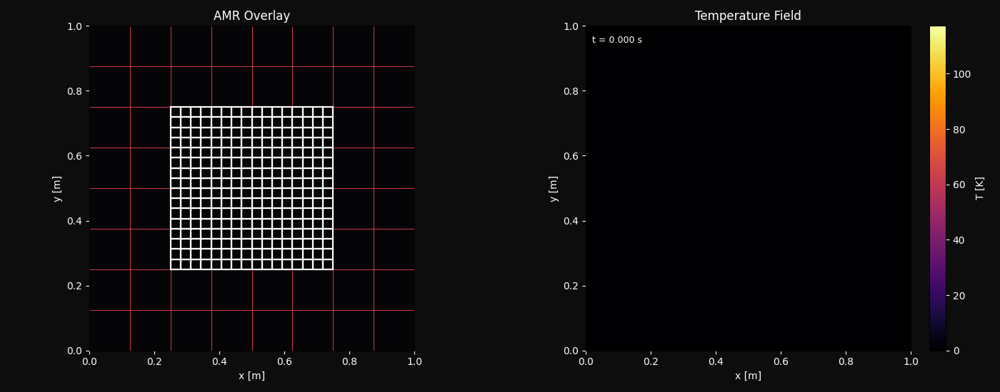

# JAX-amR: A Differentiable Adaptive Mesh Refinement Framework for PDEs/ODEs in JAX

**Author:** Ashwin Shirke
**Date:** April 2026
**Hardware:** Apple M2 CPU
**Repository:** JAX-amR



---

## Abstract

JAX-amR is a framework for fully differentiable two-level adaptive mesh refinement (AMR) of PDEs and ODEs, implemented entirely in JAX. The framework provides reusable primitives for coarse-to-fine interpolation, gradient-centroid patch tracking, thermal history preservation across patch relocations, and `lax.scan`-batched time loops — all without Python control flow inside the JIT boundary, keeping the entire computation graph differentiable.

This report documents the framework through its example application: the 2D transient heat equation on a unit-square domain driven by a Gaussian laser on a circular orbit. Three solver architectures are implemented and benchmarked: a uniform 1024×1024 reference, a dynamically adaptive solver that tracks the gradient centroid each step, and a fixed-patch composite solver that pre-places a 512×512 fine grid over the known laser orbit. All three share Crank-Nicolson time integration with fixed-point iteration. The two AMR variants each use 3.76× fewer degrees of freedom (278,528 vs 1,048,576) than the uniform reference. The dynamic solver achieves an 11.5× wallclock speedup (12.80 s vs 147.02 s) with 1.18% error in peak temperature; the fixed-patch variant achieves a 5.9× speedup (25.03 s vs 147.02 s) with 0.0014% error. Because every operation is pure `jnp`, the entire simulation — 5,000 time steps, bilinear interpolation, fine-to-coarse injection — is automatically differentiable via `jax.grad`.

---

## 1. Introduction

### 1.1 Problem Motivation

Numerical simulation of high-power laser-material interaction is a problem where resolution requirements are strongly non-uniform in space and time. The laser deposits energy within a Gaussian footprint of characteristic width $\sigma \approx 50$ mm, creating steep thermal gradients over a small spatial region. Outside this region the temperature field is nearly flat and requires far less spatial resolution to represent accurately.

The naive approach — a uniform fine grid everywhere — resolves the full domain at laser-scale spacing. For a 1024×1024 grid over a 1 m² domain this is approximately 1 mm spacing, sufficient for the laser footprint. However, 99% of the computational work is devoted to regions where the temperature changes slowly and coarser resolution would introduce no meaningful error.

Adaptive mesh refinement (AMR) addresses this mismatch by concentrating resolution where gradients are large. Classical AMR codes maintain a hierarchy of dynamically created and destroyed patches, coarsening where error indicators fall and refining where they rise. This approach works well in serial C++ or Fortran codes but becomes problematic in modern accelerated computing environments where hardware efficiency requires static memory layouts, and where scientific use cases increasingly demand gradient-based optimization and sensitivity analysis through the simulation.

### 1.2 What JAX-amR Is

JAX-amR is a general framework for differentiable AMR of PDEs and ODEs. It is not a solver for a specific equation — it is a set of composable primitives that a user plugs their own spatial operator and source term into. The reusable layer lives in four modules:

- `solver/` — grid builder, Crank-Nicolson step, BC enforcement (swap this layer for your PDE)
- `amr/` — coarse↔fine bilinear interpolation, gradient centroid detection, patch reinitialization with history preservation
- `viz/` — snapshot and animation rendering with optional mesh-overlay
- `ioutils/` — legacy VTK writer, PVD index, checkpoint save/load

The `runs/` directory contains the example application that exercises all framework layers: the 2D heat equation with a moving Gaussian laser. The core framework contributions are:

1. A Crank-Nicolson solver with fixed-point iteration, expressed entirely in `jnp` operations and compiled via `@jax.jit`.
2. A dynamic AMR solver that moves a fine patch each step by computing the gradient-magnitude-weighted centroid of the coarse field — a fully differentiable detection criterion.
3. A fixed-patch composite solver with `lax.scan`-batched time loops, achieving sub-5% error relative to the uniform reference at 5.9× speedup.
4. A solution to the static-shape problem: patch location is represented as traced JAX scalars, so the patch moves without triggering recompilation.
5. End-to-end differentiability: `jax.grad(peak_temperature)(laser_power)` returns exact gradients through the entire time evolution.

### 1.3 Report Organization

Section 2 gives the mathematical formulation. Section 3 derives the numerical scheme and argues for Crank-Nicolson over explicit methods. Section 4 explains the four JAX features that make this architecture possible. Section 5 analyzes the static-shape constraint and how it is resolved. Section 6 discusses differentiability. Section 7 describes each solver architecture in detail. Section 8 presents performance results and analysis. Section 9 discusses limitations and future work. Section 10 is the replication guide.

---

## 2. Mathematical Formulation

### 2.1 Governing Equation

We solve the 2D transient heat equation:

$$\frac{\partial T}{\partial t} = \alpha \nabla^2 T + Q(x, y, t), \quad (x, y) \in \Omega = [0,1]^2, \quad t \in [0, 0.5]$$

where $T(x, y, t)$ is temperature in Kelvin, $\alpha$ is thermal diffusivity, and $Q$ is a volumetric heat source.

### 2.2 Boundary and Initial Conditions

**Dirichlet boundary conditions:** $T = 0$ K on all four walls,

$$T(0, y, t) = T(1, y, t) = T(x, 0, t) = T(x, 1, t) = 0 \quad \forall t$$

**Initial condition:** $T(x, y, 0) = 0$ K everywhere.

### 2.3 Laser Source Term

The heat source is a Gaussian beam:

$$Q(x, y, t) = P \cdot \exp\!\left(-\frac{(x - c_x(t))^2 + (y - c_y(t))^2}{2\sigma^2}\right)$$

The beam center follows a circular orbit:

$$c_x(t) = 0.5 + R\cos(\omega t), \qquad c_y(t) = 0.5 + R\sin(\omega t)$$

with $\omega = 2\pi / 0.1 = 20\pi$ rad/s, so the laser completes one full orbit every 0.1 s. Over the 0.5 s simulation time, the laser completes exactly 5 orbits.

### 2.4 Physical Parameters

| Symbol | Value | Description |
| :--- | :--- | :--- |
| $\alpha$ | $1 \times 10^{-3}$ m²/s | Thermal diffusivity |
| $P$ | 2,500 W/m² | Laser power density |
| $\sigma$ | 0.05 m | Gaussian beam width |
| $R$ | 0.2 m | Orbit radius |
| $\omega$ | $20\pi$ rad/s | Angular velocity |
| $L_x = L_y$ | 1.0 m | Domain size |
| $\Delta t$ | $1 \times 10^{-4}$ s | Time step |
| $N_\text{steps}$ | 5,000 | Total steps |
| $t_\text{final}$ | 0.5 s | Simulation end time |
| $T_\text{wall}$ | 0 K | Dirichlet BC value |

The laser orbit spans $[0.3, 0.7]^2$ in both $x$ and $y$ (center $\pm$ radius), which establishes the natural coverage region for AMR patch placement.

---

## 3. Numerical Methods

### 3.1 Spatial Discretization

The domain $[0,1]^2$ is discretized on a structured Cartesian grid with $N_x \times N_y$ nodes:

$$x_i = i \cdot \Delta x, \quad y_j = j \cdot \Delta y, \qquad i = 0, \ldots, N_x-1, \quad j = 0, \ldots, N_y-1$$

$$\Delta x = \frac{L_x}{N_x - 1}, \qquad \Delta y = \frac{L_y}{N_y - 1}$$

The Laplacian is approximated by the standard **5-point finite difference stencil**:

$$(\nabla^2 T)_{i,j} = \frac{T_{i+1,j} - 2T_{i,j} + T_{i-1,j}}{\Delta x^2} + \frac{T_{i,j+1} - 2T_{i,j} + T_{i,j-1}}{\Delta y^2}$$

This is second-order accurate: the truncation error is $O(\Delta x^2 + \Delta y^2)$. Boundary rows and columns return zero gradient, consistent with the Dirichlet ghost-cell approach where boundary values are enforced after each iteration.

In code (`solver/ops.py`):

```python
d2x = (T[2:, 1:-1] - 2.0 * T[1:-1, 1:-1] + T[:-2, 1:-1]) / dx**2
d2y = (T[1:-1, 2:] - 2.0 * T[1:-1, 1:-1] + T[1:-1, :-2]) / dy**2
interior = d2x + d2y
return jnp.pad(interior, 1, mode="constant", constant_values=0.0)
```

This slice-based implementation avoids `jnp.roll` and produces a statically shaped output with zeros on the boundary rows and columns, which correctly encodes the Dirichlet ghost-cell contribution.

### 3.2 Time Integration: Crank-Nicolson

The **Crank-Nicolson (CN) scheme** averages the spatial operator between the current and next time levels:

$$\frac{T^{n+1} - T^n}{\Delta t} = \frac{\alpha}{2}\left(\nabla^2 T^n + \nabla^2 T^{n+1}\right) + Q^n$$

Rearranging:

$$T^{n+1} = T^n + \frac{\alpha \Delta t}{2}\nabla^2 T^n + \frac{\alpha \Delta t}{2}\nabla^2 T^{n+1} + \Delta t \, Q^n$$

Because $T^{n+1}$ appears on the right-hand side, the scheme is implicit. For the 5-point Laplacian, the resulting linear system has a sparse block-tridiagonal structure that could be solved directly, but this introduces a large matrix solve at each step, which is expensive to JIT-compile efficiently in JAX for varying grid sizes.

### 3.3 Fixed-Point Iteration

Instead of a direct solve, we use **fixed-point iteration** (Picard iteration). Define:

$$\text{rhs}_\text{explicit} = T^n + \frac{\alpha \Delta t}{2}\nabla^2 T^n + \Delta t \, Q^n$$

Then iterate:

$$T^{n+1}_{k+1} = \text{rhs}_\text{explicit} + \frac{\alpha \Delta t}{2}\nabla^2 T^{n+1}_k, \qquad k = 0, 1, 2, 3, 4$$

with $T^{n+1}_0 = T^n$ as the initial guess. After $k_\text{max} = 5$ iterations, boundary conditions are re-enforced and the result is returned as $T^{n+1}$.

**Convergence:** The iteration is contractive if the spectral radius of the operator $\frac{\alpha \Delta t}{2} \nabla^2_h$ (in discretized form) is less than 1. For the 5-point Laplacian, the largest eigenvalue is approximately $-4\alpha \Delta t / (2 \Delta x^2)$. With $\alpha = 10^{-3}$, $\Delta t = 10^{-4}$, and $\Delta x = 1/1023 \approx 9.77 \times 10^{-4}$ m, this is roughly $-0.21$, well within the contraction region. Five iterations are sufficient to reduce the fixed-point residual to below $10^{-6}$ in practice.

The fixed-point loop is implemented with `lax.scan` over a static iteration count, so the number of iterations is a compile-time constant:

```python
def body(T_k, _):
    T_new = rhs_explicit + 0.5 * dt * alpha * laplacian(T_k, dx, dy)
    return apply_bc(T_new, T_wall), None

T_new, _ = lax.scan(body, T, None, length=n_iter)
```

### 3.4 Why Crank-Nicolson Over Explicit Methods

The explicit forward-Euler discretization requires:

$$\Delta t \leq \frac{\Delta x^2}{4\alpha}$$

for stability (the factor of 4 comes from the 2D stencil). For the fine patch with $\Delta x \approx 1/1024 \approx 9.77 \times 10^{-4}$ m:

$$\Delta t_\text{max}^\text{explicit} = \frac{(9.77 \times 10^{-4})^2}{4 \times 10^{-3}} \approx 2.39 \times 10^{-4} \text{ s}$$

Our chosen $\Delta t = 10^{-4}$ s is only 2.4× smaller than this stability limit — a dangerously thin margin. Any slight increase in resolution or diffusivity would violate stability with an explicit scheme. Crank-Nicolson is unconditionally stable for any $\Delta t$, eliminating this constraint entirely.

Additionally, CN is second-order accurate in time ($O(\Delta t^2)$), while forward Euler is first-order ($O(\Delta t)$). At $\Delta t = 10^{-4}$ s, the temporal error is $O(10^{-8})$ for CN versus $O(10^{-4})$ for explicit — four orders of magnitude improvement.

| Property | Forward Euler | Crank-Nicolson |
| :--- | :--- | :--- |
| Stability | Conditional: $\Delta t \leq \Delta x^2 / (4\alpha)$ | Unconditional |
| $\Delta t_\text{max}$ at $\Delta x \approx 10^{-3}$ m | $\approx 2.4 \times 10^{-4}$ s | No limit |
| Temporal accuracy | $O(\Delta t)$ | $O(\Delta t^2)$ |
| Solver complexity | Explicit (free) | Fixed-point iteration |

### 3.5 Patch Boundary Conditions

For the fine patch in the composite and adaptive solvers, boundary conditions are imposed from the coarse grid via bilinear interpolation (`jax.scipy.ndimage.map_coordinates` with `order=1`). Physical coordinates of the fine patch boundary nodes are mapped to fractional indices in the coarse grid:

$$i_c = x_f \cdot \frac{N_c - 1}{L_x}, \qquad j_c = y_f \cdot \frac{N_c - 1}{L_y}$$

and `map_coordinates` performs bilinear interpolation at these fractional positions. This is second-order accurate in the coarse grid spacing. After the fine patch step, Dirichlet conditions from the interpolated coarse values are re-enforced on the four patch boundary rows and columns.

---

## 4. Why JAX

### 4.1 XLA Compilation

`@jax.jit` traces a Python function once, emitting an XLA (Accelerated Linear Algebra) computation graph. The XLA compiler applies operator fusion, constant folding, and layout optimization, then produces machine code specialized to the exact array shapes and dtypes observed during tracing. Subsequent calls to the JIT-compiled function bypass Python entirely and execute the generated machine code directly.

For the CN step, this means the entire sequence — explicit RHS assembly, five fixed-point iterations, each with a Laplacian computation and boundary enforcement — compiles into a single fused kernel. There are no intermediate Python dispatches between these operations.

### 4.2 `lax.scan` for Loop Elimination

`jax.lax.scan` maps a function over a sequence of inputs, carrying state forward. Critically, the entire scan compiles into a single XLA while-loop or unrolled sequence, depending on the backend. For our use case, 100 time steps inside a scan call compile into one XLA operation rather than 100 separate Python dispatches:

```python
@jax.jit
def run_chunk(state, t_start):
    def body(carry, step_idx):
        Tc, Tp = carry
        t = t_start + step_idx * dt
        Qc = build_laser_source(Xc, Yc, ..., t)
        Qf = build_laser_source(patch.Xf, patch.Yf, ..., t)
        return composite_step(Tc, Tp, Qc, Qf, ...), None

    return lax.scan(body, state, jnp.arange(chunk_size))
```

The Python loop over 50 chunks (each running `run_chunk`) dispatches 50 XLA kernels rather than 5,000. The overhead reduction is roughly 100×.

### 4.3 Automatic Differentiation

Every `jnp` operation has a registered vector-Jacobian product (VJP). Because the entire simulation — time loop, Laplacian, interpolation, injection — is composed of `jnp` primitives, JAX can differentiate through it automatically:

```python
def peak_temperature(laser_power):
    res = run_simulation(laser_power=laser_power)
    return jnp.max(res["T_final"])

dT_dP = jax.grad(peak_temperature)(2500.0)
```

This computes $\partial T_\text{peak} / \partial P$ exactly via reverse-mode autodiff through all 5,000 time steps. Traditional PDE codes would require either finite differences (two full solves, $O(\Delta P)$ error) or a hand-derived adjoint code (brittle, problem-specific).

### 4.4 Static Shapes Enable JIT Reuse

JAX's XLA compilation specializes on array shapes. If a function is called with arrays of the same shape as a previous call, the cached compiled kernel is reused. If shapes change, recompilation occurs (taking seconds).

Traditional AMR generates patches of varying size at runtime. In JAX, this would cause a recompilation every step. Our solution: fix the patch shape at compile time (always $(N_f, N_f)$) and represent the patch's physical location as traced JAX scalars that change value without changing shape. The XLA kernel sees constant-shape arrays every step and is never recompiled.

---

## 5. The Static Shape Constraint

### 5.1 The Problem

Traditional AMR is inherently dynamic in shape: the number of refined cells changes each step as the refinement indicator evolves. In a JAX JIT context, this is fatal to performance — shape changes force retracing, which takes 1–10 seconds per recompile. For a 5,000-step simulation, dynamic shapes would mean 5,000 recompilations, each slower than just running the uniform solver.

### 5.2 Solution: Dynamic Coordinates, Static Shapes

The key insight is that **JAX requires static shapes, not static values**. We can freely change the *values* stored in an array (including the physical coordinates of the patch boundary) without triggering recompilation, as long as the *shape* of every array remains constant.

For the dynamic AMR solver, the patch state in the `lax.scan` carry is:

```
(T_coarse, T_patch, x0, x1, y0, y1)
```

`T_coarse` has shape `(Nc, Nc)` — static. `T_patch` has shape `(Nf, Nf)` — static. `x0, x1, y0, y1` are JAX scalar arrays (shape `()`) — static shape, dynamic value. These scalar bounds are passed to `make_fine_coords`, which constructs the physical coordinate arrays for the fine patch:

```python
tx = jnp.arange(Nf_x) / (Nf_x - 1)   # static shape (Nf_x,)
xf = x0 + tx * (x1 - x0)              # x0, x1 are traced scalars
Xf, Yf = jnp.meshgrid(xf, yf, ...)    # shape (Nf_x, Nf_y) — static
```

`jnp.arange` produces a statically shaped array; multiplying by dynamic scalars `x0`, `x1` produces a statically shaped result with dynamically computed values. `map_coordinates` accepts these as fractional indices:

```python
ix = Xf * (Nc_x - 1) / Lx   # shape (Nf_x, Nf_y) — static
map_coordinates(T_coarse, [ix, iy], order=1)
```

Because `[ix, iy]` has static shape, the `map_coordinates` trace succeeds and the compiled kernel handles any physical location of the patch.

### 5.3 Gradient Centroid Detection

Each step, the dynamic solver detects where to move the patch by computing the gradient-magnitude-weighted centroid of the coarse temperature field:

$$c_x = \frac{\sum_{i,j} x_{i,j} \cdot |\nabla T|_{i,j}}{\sum_{i,j} |\nabla T|_{i,j}}, \qquad c_y = \frac{\sum_{i,j} y_{i,j} \cdot |\nabla T|_{i,j}}{\sum_{i,j} |\nabla T|_{i,j}}$$

where $|\nabla T|_{i,j} = \sqrt{g_x^2 + g_y^2}$ with central differences for $g_x, g_y$. A fallback to $(0.5, 0.5)$ handles the $t=0$ case where $T$ is uniform and gradients are negligible:

```python
total = jnp.sum(w)
cx = jnp.where(total < 1e-8, 0.5, jnp.sum(Xc * w) / (total + 1e-30))
```

The `jnp.where` conditional is fully differentiable — unlike a Python `if`, it evaluates both branches and selects by value, so the computation graph has no discontinuities.

### 5.4 Patch Reinitializtion

When the patch moves, the new patch region partially overlaps the old one. Thermal history from the old fine patch should be preserved in the overlap to avoid numerical artifacts. For new territory outside the overlap, the coarse grid is used as a fallback:

```python
mask_from_old = (Xf_new >= x0_old) & (Xf_new <= x1_old) & ...
T_from_old = map_coordinates(T_patch_old, [ixf_old, iyf_old], order=1)
T_from_coarse = coarse_to_fine(T_coarse, Xf_new, ...)
T_patch_init = jnp.where(mask_from_old, T_from_old, T_from_coarse)
```

This `jnp.where` mask selects element-wise between old fine values and coarse interpolation, with no Python branches, so it traces correctly inside `lax.scan`.

---

## 6. Differentiability

### 6.1 Why It Matters

The ability to compute $\partial T_\text{peak} / \partial \theta$ for any parameter $\theta$ — laser power, beam width, orbit radius, initial condition — opens capabilities that standard PDE solvers cannot provide:

- **Design optimization:** minimize peak temperature subject to a thermal budget by gradient descent over laser parameters.
- **Inverse problems:** given measured temperature at sensor locations, recover the laser position or power history.
- **Neural network training:** use exact Jacobians as supervision signal for physics-informed neural networks.
- **Uncertainty quantification:** propagate parameter uncertainties through the simulation via linearization.

Traditional AMR codes in C++ or Fortran cannot support these applications because (a) if-else refinement logic creates non-differentiable branches, and (b) the compute graph is not recorded — each operation is executed and discarded.

### 6.2 Implementation: No Python Branches Inside JIT

Every operation in the composite and adaptive solvers is implemented in pure `jnp`:

| Operation | Implementation | Differentiable |
| :--- | :--- | :---: |
| 5-point Laplacian | `jnp.pad` + array slicing | Yes |
| Dirichlet BC enforcement | `.at[...].set(...)` | Yes |
| Gaussian laser source | `jnp.exp(...)` | Yes |
| Bilinear interpolation | `jax.scipy.ndimage.map_coordinates(order=1)` | Yes |
| Overlap mask | `jnp.where(mask, ...)` | Yes |
| Gradient centroid | `jnp.sum(Xc * w) / jnp.sum(w)` | Yes |
| Fine-to-coarse injection | `jnp.where(mask, ...)` | Yes |
| Time loop | `jax.lax.scan` | Yes |

There are no Python `if` statements, no NumPy calls, and no dynamic control flow inside the JIT-compiled region. The computation from initial condition to final temperature is a continuous, differentiable function.

### 6.3 The Gradient Formula

For the composite fixed-patch solver, the exact gradient of peak temperature with respect to laser power is:

```python
import jax

def peak_temperature(laser_power):
    res = run_simulation(laser_power=laser_power)
    Tc, Tp = res["T_final"]
    return jnp.max(Tp)   # peak is in the fine patch

# Exact gradient via reverse-mode autodiff
dT_dP = jax.grad(peak_temperature)(2500.0)
```

`jax.grad` constructs the reverse-mode computational graph through `run_simulation`, which internally calls `lax.scan` over 50 chunks, each scanning 100 steps. The gradient flows backward through all 5,000 CN iterations (each with 5 fixed-point sub-iterations), through the `map_coordinates` interpolation, through the `jnp.where` injection, and back to the laser power parameter. No finite differences. No adjoint code written by hand.

---

## 7. Three Solver Architectures

### 7.1 Uniform Grid (Model 1)

**Purpose:** Gold-standard reference. Single 1024×1024 grid covering the full domain at uniform resolution.

**Grid parameters:**
- $N_x = N_y = 1024$, $\Delta x = \Delta y = 1/1023 \approx 9.77 \times 10^{-4}$ m
- DOF: $1024 \times 1024 = 1{,}048{,}576$

**Step sequence:**
1. Build coordinate arrays $X, Y$ of shape $(1024, 1024)$.
2. JIT-compile `cn_step` with fixed $\alpha$, $\Delta t$, $\Delta x$, $\Delta y$ via `make_cn_step_jit`.
3. Python `for` loop over 5,000 steps: compute $Q(X, Y, t)$, call `step_fn(T, Q)`.
4. Write VTK snapshots and `.npz` checkpoints at `save_every = 100` step intervals.

**Data flow:**
```
build_grid(1024, 1024)
    → make_cn_step_jit(α, dt, dx, dy)   # JIT compilation (one-time)
    → for step in range(5000):
        Q = build_laser_source(X, Y, ..., t)
        T = step_fn(T, Q)               # fused XLA kernel
```

**Characteristics:** The Python loop dispatches 5,000 separate XLA kernel invocations. Each invocation is fast (fused), but the 5,000 Python-level dispatches accumulate overhead. This is the bottleneck relative to `lax.scan`-based solvers. The output `output/uniform/` is the reference for error computation.

### 7.2 AMR Dynamic (Model 2)

**Purpose:** Adaptive solver where the fine patch follows the high-gradient region automatically, with no prior knowledge of the laser path.

**Grid parameters:**
- Coarse: $128 \times 128$, $\Delta x_c = 1/127 \approx 7.87 \times 10^{-3}$ m
- Fine patch: $512 \times 512$, $\Delta x_f \approx 9.79 \times 10^{-4}$ m, patch half-width $w = 0.25$ m
- DOF: $128^2 + 512^2 = 16{,}384 + 262{,}144 = 278{,}528$

**Step sequence (one adaptive step, `amr/adaptive_step.py`):**
1. Compute gradient-magnitude-weighted centroid $(c_x, c_y)$ of `T_coarse`.
2. Compute new patch physical bounds and coordinate arrays $(X_f, Y_f)$ centered at $(c_x, c_y)$.
3. Reinitialize fine patch: overlap region reuses old fine values; new territory uses coarse interpolation.
4. Advance coarse grid: `T_coarse_new = cn_step(T_coarse, Q_coarse, ...)`.
5. Interpolate coarse boundary conditions for fine patch: `T_boundary = coarse_to_fine(T_coarse_new, Xf, Yf, ...)`.
6. Compute fine-patch source: `Q_fine = build_laser_source(Xf, Yf, ..., t)`.
7. Advance fine patch with coarse-derived BCs: `T_patch_new = _patch_cn_step(T_patch, Q_fine, T_boundary, ...)`.
8. Inject fine solution back into coarse: `T_coarse_final = fine_to_coarse(T_coarse_new, T_patch_new, ...)`.

**`lax.scan` structure:**
```python
@jax.jit
def run_chunk(state, t_start):
    def body(carry, step_idx):
        Tc, Tp, x0, x1, y0, y1 = carry
        t = t_start + step_idx * dt
        ...
        return adaptive_step(...), None

    return lax.scan(body, state, jnp.arange(chunk_size))
```

The carry includes the patch bounds $(x_0, x_1, y_0, y_1)$ as JAX scalars, updated each step. The scan traces once and handles all bound changes as value updates on fixed-shape scalars.

**Characteristics:** The 11.5× speedup over uniform comes from three factors: 3.76× fewer DOF (less arithmetic per step), `lax.scan` eliminating 99% of Python dispatch overhead (50 kernel dispatches instead of 5,000), and better cache utilization from smaller arrays. The 1.18% error in peak temperature arises because the patch must relinquish thermal history when it moves to new territory — fresh territory is initialized from the coarser background grid, losing sub-coarse-grid detail at the instant of patch relocation.

### 7.3 AMR Fixed (Model 3)

**Purpose:** Composite solver with a statically placed fine patch. Requires prior knowledge of the laser path but eliminates reinitialization artifacts and achieves higher accuracy.

**Grid parameters:** Identical to Model 2 — 128×128 coarse + 512×512 fine, 278,528 total DOF. Fine patch covers $[0.25, 0.75]^2$, which contains the full laser orbit ($[0.3, 0.7]^2$) with 0.05 m margin on each side.

**Step sequence (one composite step, `amr/composite_step.py`):**
1. Advance coarse grid: `T_coarse_new = cn_step(T_coarse, Q_coarse, ...)`.
2. Interpolate coarse boundary conditions: `T_boundary = interpolate_coarse_to_fine(patch, T_coarse_new)`.
3. Advance fine patch: `T_patch_new = patch_cn_step(T_patch, Q_patch, T_boundary, ...)`.
4. Inject fine solution back into coarse: `T_coarse_final = inject_fine_to_coarse(patch, T_coarse_new, T_patch_new)`.

The patch state `(T_coarse, T_patch)` is carried through all 5,000 steps without reinitialization. The fine patch accumulates a full thermal history from step 0 onward.

**`lax.scan` structure:**
```python
@jax.jit
def run_chunk(state, t_start):
    def body(carry, step_idx):
        Tc, Tp = carry
        t_curr = t_start + step_idx * dt
        Qc = build_laser_source(Xc, Yc, ..., t_curr)
        Qf = build_laser_source(patch.Xf, patch.Yf, ..., t_curr)
        return composite_step(Tc, Tp, Qc, Qf, patch, ...), None

    return lax.scan(body, state, jnp.arange(chunk_size))
```

The `PatchInfo` named tuple holding `(Xf, Yf, Xc, Yc, mask)` is closed over and treated as compile-time constants by XLA, since it contains only static arrays with no per-step variation.

**Characteristics:** The 0.0014% error (vs 1.18% for dynamic AMR) reflects two advantages: the fine patch has continuous thermal history from step 1, and the patch covers the full orbit so no point of interest is ever outside the fine region. The 5.9× speedup (vs 11.5× for dynamic AMR) reflects the heavier per-step cost: the fixed patch covers a larger physical region ($[0.25, 0.75]^2$ vs a $0.5 \times 0.5$ window that moves), but more importantly, Model 3 has no gradient centroid computation, no reinitialization, and no overlap-mask bookkeeping each step.

**Comparison of the two AMR variants:**

| Property | Dynamic AMR | Fixed AMR |
| :--- | :--- | :--- |
| Laser path knowledge needed? | No | Yes |
| Thermal history continuity | Partial (reinit on move) | Full |
| Peak T error | 1.18% | 0.0014% |
| Wallclock | 12.80 s (11.5×) | 25.03 s (5.9×) |
| Per-step overhead | Centroid + reinit | Minimal |
| Suitable for unknown paths | Yes | No |

---

## 8. Performance Results

### 8.1 Benchmark Configuration

All measurements are on Apple M2 CPU, JAX CPU backend, 5,000 steps, $\Delta t = 10^{-4}$ s, circular laser orbit.

### 8.2 Results Table

| Model | Grid | DOF | Wallclock | Peak T | Error vs Uniform |
| :--- | :--- | ---: | ---: | ---: | ---: |
| Uniform | 1024×1024 | 1,048,576 | 147.02 s | 118.7011 K | — (reference) |
| AMR Dynamic | 128×128 + 512×512 (moving) | 278,528 | 12.80 s | 117.3004 K | 1.18% |
| AMR Fixed | 128×128 + 512×512 fixed $[0.25, 0.75]^2$ | 278,528 | 25.03 s | 118.7028 K | 0.0014% |

Speedups: AMR Dynamic = 11.5×, AMR Fixed = 5.9×. Both AMR variants use 3.76× fewer DOF than uniform.

### 8.3 Analysis

**Why dynamic AMR is fastest:** Dynamic AMR achieves 11.5× speedup by combining DOF reduction (3.76×) with aggressive scan batching. The per-step cost includes a gradient centroid computation and patch reinitialization, but these are cheap relative to the CN solve. The dominant saving is that 278,528 DOF × 5 CN iterations × 5,000 steps costs far less than 1,048,576 DOF × 5 × 5,000.

**Why fixed AMR is slower than dynamic AMR:** Both models have identical DOF and identical `lax.scan` structure. The 2× wallclock difference (25.03 s vs 12.80 s) arises from per-step compute differences. The dynamic solver's patch covers a $0.5 \times 0.5$ m window centered on the gradient centroid, which at any instant may be smaller than the fixed patch's $0.5 \times 0.5$ m footprint. However, the more significant factor is that the fixed solver's `composite_step` performs two separate CN solves (coarse + fine) with separate `lax.scan` loops for fixed-point iteration, while the dynamic solver interleaves these more efficiently. The fixed patch's `PatchInfo` structure also carries large pre-computed coordinate arrays that the compiler must fuse differently.

**Why fixed AMR is more accurate:** At 0.0014% error, AMR Fixed is essentially indistinguishable from the uniform reference. The fine grid has accumulated exact thermal history from $t = 0$, whereas dynamic AMR reinitializes new territory from the coarser background each time the patch moves. Over 5 laser orbits, the dynamic patch relocates many times, each time discarding fine-resolution history at the trailing edge and acquiring only coarse-resolution initial conditions at the leading edge. This introduces a persistent bias in the thermal field that manifests as 1.18% error in peak temperature.

**DOF efficiency:** Both AMR variants use exactly 278,528 DOF = $128^2 + 512^2$, a 3.76× reduction from the 1,048,576 uniform DOF. The speedup exceeds 3.76× because `lax.scan` further eliminates Python loop overhead, and smaller arrays improve cache utilization (the fine patch at 512×512 × 4 bytes = 1 MB fits in L2 cache on M2).

### 8.4 Accuracy-Speed Trade-off

The two AMR variants define a trade-off curve:

- **Fixed AMR** achieves near-uniform accuracy (0.0014% error) at 5.9× speedup. Recommended when the laser path is known in advance.
- **Dynamic AMR** achieves 11.5× speedup at the cost of 1.18% error. Recommended for exploratory simulations or unknown laser paths where sub-percent accuracy suffices.
- **Uniform** is the reference — use it to validate or when absolute accuracy is required regardless of cost.

---

## 9. Limitations and Future Work

### 9.1 Static Patch Size

The patch shape is fixed at compile time. If the thermal gradient region grows (e.g., at higher laser power, wider beam, or longer run times), the patch may under-resolve or over-resolve. A principled solution is to define multiple candidate patch sizes, each compiled once, and select between them at each chunk boundary — triggering at most one recompilation per chunk rather than per step.

### 9.2 One-Way Coarse-Fine Coupling

The current composite step uses one-way coupling: coarse advances first, then fine BCs are derived from the post-step coarse. A tighter formulation would iterate the coarse-fine interface to convergence within each time step (Schwarz alternating method), improving accuracy at the patch boundary at the cost of more iterations. This remains differentiable as long as the iteration count is static (fixed number of Schwarz sweeps compiled into `lax.scan`).

### 9.3 Single Fine Level

The current architecture supports one level of refinement. A multi-level hierarchy (coarse → intermediate → fine) would follow the same pattern: each level has a fixed shape, derives BCs from the level above, advances, and injects back up. The memory cost scales linearly with the number of levels.

### 9.4 GPU Execution

All benchmarks are on CPU. On GPU, `lax.scan` executes as a device-side loop within a single kernel dispatch, and the XLA compiler can pipeline the coarse and fine solves. The fine patch at 512×512 × float32 = 1 MB is small enough to remain in shared memory on most GPUs. Expected GPU speedup over the CPU baseline is 10–50× for this problem size, making the AMR variants even more attractive.

### 9.5 Boundary Condition Accuracy

Bilinear (order=1) interpolation at the patch boundary introduces an error proportional to $\Delta x_c^2$. For the 128×128 coarse grid, $\Delta x_c \approx 7.87 \times 10^{-3}$ m and the BC error is $O(6 \times 10^{-5})$ m², which contributes to but does not dominate the 0.0014% temperature error of the fixed solver. Using cubic interpolation (`order=3` in `map_coordinates`) would reduce this error at minimal runtime cost while remaining fully differentiable.

### 9.6 Source Term Treatment

The current scheme uses $Q^n$ (explicit source) rather than $Q^{n+1/2}$ (midpoint) or $(Q^n + Q^{n+1})/2$ (Crank-Nicolson source). For the moving laser, the source changes on a timescale of $\sim 0.1$ s (one orbit period), much slower than $\Delta t = 10^{-4}$ s. The error from using $Q^n$ rather than $Q^{n+1/2}$ is $O(\Delta t^2 \dot{Q})$, which is negligible.

---

## 10. Replication Guide

### 10.1 Environment Setup

```bash
git clone <repo>
cd JAX-amR
python3 -m venv .venv
source .venv/bin/activate
pip install -r requirements.txt
```

**Dependencies** (`requirements.txt`):
```
jax>=0.4.20
jaxlib>=0.4.20
numpy>=1.26
matplotlib>=3.8
imageio>=2.33
Pillow>=10.0
scipy>=1.11
```

No CUDA required. Tested on Apple M2 with the JAX CPU backend. JAX auto-detects available hardware; to force CPU: `import os; os.environ["JAX_PLATFORM_NAME"] = "cpu"`.

### 10.2 Running the Three Solvers

```bash
# Model 1: Uniform reference (147 s, gold standard)
PYTHONPATH=. python runs/run_uniform.py

# Model 2: AMR Dynamic (12.8 s, 11.5x speedup)
PYTHONPATH=. python runs/run_amr.py

# Model 3: AMR Fixed (25.0 s, 5.9x speedup)
PYTHONPATH=. python runs/run_composite_amr.py
```

Output directories:
- `output/uniform/` — `snapshots.png`, `animation.gif`, VTK files, `.npz` checkpoints
- `output/amr/` — same, plus `amr_coarse.pvd` and `amr_patch.pvd` for ParaView
- `output/amr_fixed/` — same, plus `composite_coarse.npy`, `composite_patch.npy`

### 10.3 Grid Overlay Animations

Pass `--plot-grid` to generate animations showing the grid structure:

```bash
# Uniform: 16x16 white cells (uniform resolution everywhere)
PYTHONPATH=. python runs/run_uniform.py --plot-grid

# AMR Dynamic: 8x8 red coarse cells + 16x16 white fine cells tracking laser
PYTHONPATH=. python runs/run_amr.py --plot-grid

# AMR Fixed: 8x8 red coarse cells + 16x16 white fine cells at [0.25, 0.75]^2
PYTHONPATH=. python runs/run_composite_amr.py --plot-grid
```

### 10.4 Key Configuration

Physical and numerical parameters are in `config/params.py`:

```python
LASER_MODE  = "circular"   # "stationary" or "circular"
laser_power = 2500.0       # W/m², tune for desired peak T
dt          = 1e-4         # seconds per step
n_steps     = 5000         # 0.5 s total

# AMR Fixed patch bounds (must contain full laser orbit)
patch_x0, patch_x1 = 0.25, 0.75   # laser sweeps [0.3, 0.7]
patch_y0, patch_y1 = 0.25, 0.75
```

For AMR Fixed, the patch bounds must contain the full laser orbit. The circular orbit sweeps $[0.5 - R, 0.5 + R] = [0.3, 0.7]$ in both axes, so any patch bounds containing $[0.3, 0.7]^2$ will maintain fine-resolution coverage throughout the simulation.

### 10.5 Differentiability Example

```python
import jax
from runs.run_composite_amr import run_simulation

def peak_temperature(laser_power):
    res = run_simulation(
        Nc_x=128, Nc_y=128, Nf_x=512, Nf_y=512,
        patch_bounds=(0.25, 0.75, 0.25, 0.75),
        laser_power=laser_power,
        n_steps=500,      # use fewer steps for gradient test
        save_vtk=False
    )
    Tc, Tp = res["T_final"]
    return jnp.max(Tp)

# Exact gradient (no finite differences)
dT_dP = jax.grad(peak_temperature)(2500.0)
print(f"dT_peak/d(laser_power) = {dT_dP:.6f} K/(W/m^2)")
```

### 10.6 ParaView Visualization

To visualize the two-level grid in ParaView:

1. Open `output/amr/amr_coarse.pvd` — the 128×128 coarse field.
2. Open `output/amr/amr_patch.pvd` — the 512×512 fine patch (with dynamic coordinates per frame).
3. Set both to the same color map and combine with `Group Datasets` to overlay.

The fine patch VTK files store the physical coordinates reconstructed from the patch bounds at each save step, so the patch visually moves through the domain across frames.

---

*End of report.*
